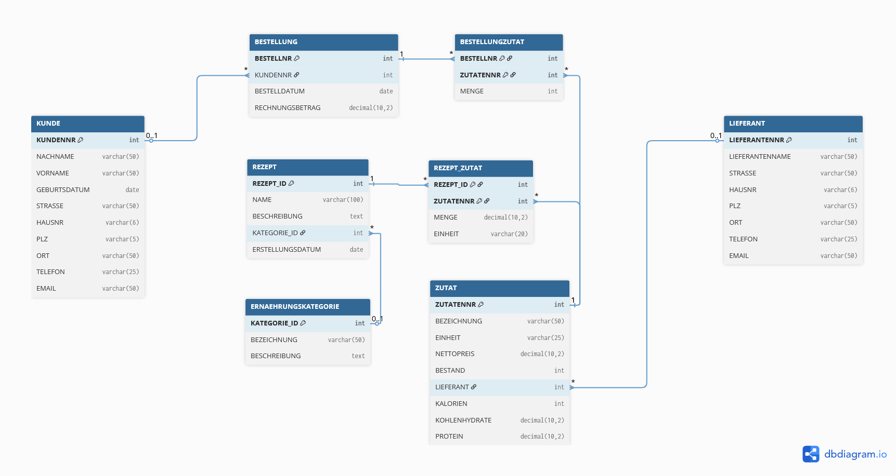

Datenbank Challenge I ITech

- Step 1: 
```bash
docker volume create pgdata

docker run -d --name postgres -e POSTGRES_USER=admin -e POSTGRES_PASSWORD=admin -e POSTGRES_DB=krautundrueben -v pgdata:/var/lib/postgresql/data -p 5432:5432 postgres:17
```
- Step 2 (inside repository): 
```bash
docker exec -i postgres psql -U admin -d krautundrueben < createTable.sql
docker exec -i postgres psql -U admin -d krautundrueben < insertTestData.sql
```
- Step 3 (Entwicklungsphase I):
```bash
docker exec -i postgres psql -U admin -d krautundrueben < createTableRezept.sql
docker exec -i postgres psql -U admin -d krautundrueben < insertTestDataRezept.sql
```
- Connect:
```bash
docker exec -it postgres psql -U admin -d krautundrueben
``` 
- Start Container:
```bash
docker start -ai postgres
```

- Entity Relationship Diagram (including Rezept Tables):


- TODO:
 [ ] ERD aktualisieren
 [ ] queries.sql in DDL, DCL, DML und DQL unterteilen
 [ ] skript für automatischen aufsetzen der db mit docker befehlen
